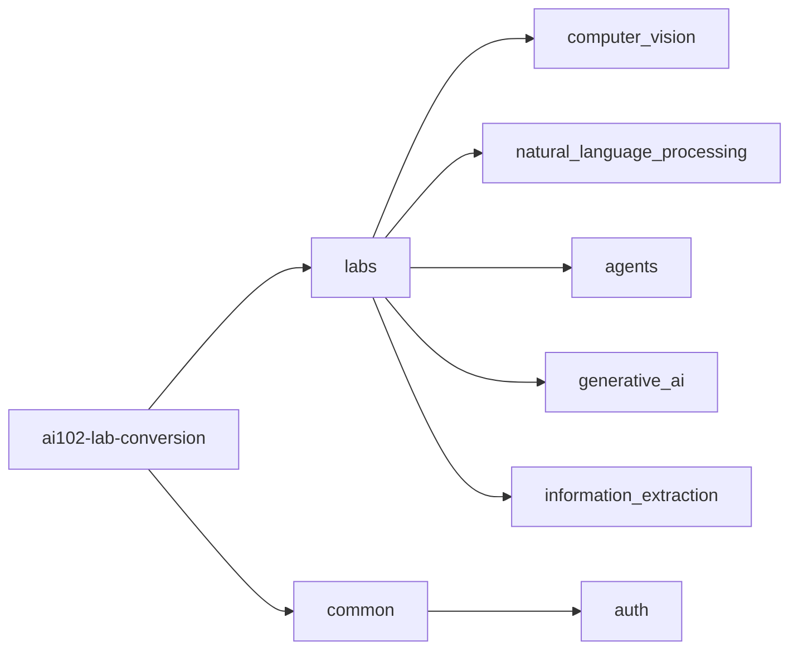

# AI-102 Lab Conversion Project

## Overview

This repository contains the converted labs from the Microsoft course AI-102T00-A: *Develop AI solutions in Azure*.  
The original labs were designed for online PowerShell environments. This project adapts them for local development using Python in Visual Studio Code (VS Code) or PyCharm.

## Key Features

- 🔄 **PowerShell to Python Conversion**: All labs have been rewritten in Python for local execution.  
- 🧭 **Universal Authentication Module**: A reusable authentication package simplifies secure access to Azure AI Foundry and other Azure services.  
- 🛠️ **Bug Fixes and Enhancements**: Adjustments made to ensure compatibility with local IDEs and Python SDKs.

## Repository Structure

## Usage
- Navigate to the relevant lab folder and run the Python scripts using VS Code or PyCharm.
- Use the `common.auth` module to authenticate and access Azure AI services.
- Each lab folder contains README or comments explaining the lab objectives and steps. (coming soon)

## 📄 License
This script is provided "as-is", without any express or implied warranty. You are free to use, modify, and distribute this code at your own risk. The author(s) shall not be held liable for any damages arising from the use of this software.
