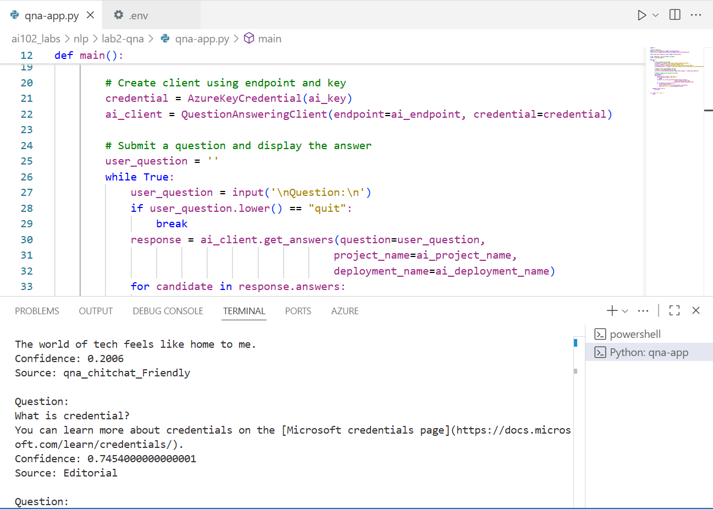

# Lab02‑qna: Create a Question Answering Solution

## Learning Objective
By the end of this lab, you will:
- Learn how to use **Azure AI Language – Question Answering** to build a knowledge‑base‑backed Q&A experience.
- Provision an Azure **Language** resource with **Custom question answering** enabled.
- Create a **question answering project** in **Language Studio**, ingest sources (FAQ URL + chit‑chat), and author follow‑ups.
- **Deploy** the project and obtain the **prediction URL**.
- Configure and run a **Python** console app that queries your deployed knowledge base using the **Azure AI Language Question Answering SDK**.

---

## What This Lab Is About
This lab demonstrates how to:
- Set up **Azure AI Language** with Custom question answering (uses **Azure Cognitive Search** under the hood).
- Build a knowledge base from an FAQ web page and **Chit‑chat** responses.
- Enrich the KB with **alternate questions** and **multi‑turn follow‑ups**.
- Test in **Language Studio**, **deploy**, and then call the KB from a **Python** client using the `azure-ai-language-questionanswering` package.

---

## Files in This Lab
### **qna-app.py**
- Loads Azure credentials and project settings from `.env`, including:
  - **AI_LANGUAGE_ENDPOINT** – Endpoint URL of your Azure AI Language resource.
  - **AI_LANGUAGE_KEY** – Authentication key for the Language resource.
  - **AI_PROJECT_NAME** – Name of your question answering project (e.g., `LearnFAQ`).
  - **AI_DEPLOYMENT_NAME** – Deployment name for the knowledge base (e.g., `production`).
- Uses the `azure-ai-language-questionanswering` SDK.
- Implements:
  - **Client Initialization**: Create a `QuestionAnsweringClient` using the Azure endpoint and key.
  - **Question Submission**: Send user-entered questions to the deployed knowledge base.
  - **Answer Retrieval**: Retrieve and display answers with confidence scores and source references.

---

## Lab Steps (Summary)

1) **Provision an Azure AI Language resource**
   - Enable **Custom question answering**; ensure the linked **Azure Cognitive Search** is in the **same (global) region**.
   - Capture **Endpoint** and **Key** (used by SDK/REST).

2) **Create a question answering project**
   - In **Language Studio**, create the project (e.g., `LearnFAQ`, language **English**), set a **default “no answer”** response.

3) **Add sources to the knowledge base**
   - Import the **FAQ URL** and add **Chit‑chat** (e.g., *Friendly*).
   - *Exam watch*: Source ingestion uses **Cognitive Search** for indexing.

4) **Edit the knowledge base**
   - Add custom Q&A pairs, **alternate questions**, and **follow‑up prompts** for **multi‑turn** (mark **contextual only** when appropriate).

5) **Train and test the knowledge base**
   - Use the **Test** pane; verify answers, **confidence**, and **source**.
   - Disable **short answer** to review full responses.

6) **Deploy the knowledge base**
   - Deploy to a slot (commonly **`production`**).
   - From **Get prediction URL**, note **`projectName`** and **`deploymentName`** *(required in API/SDK calls)*.

7) **Use in client app**
   - Configure `.env` with:
     - `AI_LANGUAGE_ENDPOINT`, `AI_LANGUAGE_KEY`
     - `AI_PROJECT_NAME` (project), `AI_DEPLOYMENT_NAME` (**KB deployment**, e.g., `production`)
   - Install `azure-ai-language-questionanswering` and dependencies.
   - Initialize `QuestionAnsweringClient` with `AzureKeyCredential`.
   - Call `get_answers(question=..., project_name=..., deployment_name=...)` and display **answer**, **confidence**, and **source**.

---

## Example Usage

### Sample question:
- **What is Microsoft Learn?**
Expected output:
- **Answer**: Microsoft Learn is an online platform that provides interactive learning paths and modules for Microsoft technologies.
- **Confidence**: 0.85 (example value)
- **Source**: https://docs.microsoft.com/en-us/learn/support/faq

---

## Key Concepts
- **Azure AI Language – Custom question answering**: Build curated Q&A knowledge bases.
- **Language Studio**: No‑code portal for authoring, testing, and deploying.
- **Azure AI Search**: Indexes KB sources for retrieval.
- **QuestionAnsweringClient**: Python SDK client for querying deployed KBs.

---

## References
- Lab instruction: https://microsoftlearning.github.io/mslearn-ai-language/Instructions/Labs/02-qna.html
- Azure AI Language overview: https://learn.microsoft.com/azure/ai-services/language-service/overview  
- Language Studio: https://language.cognitive.azure.com/  

