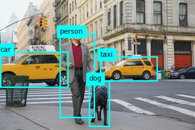
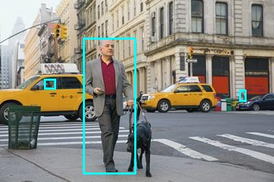

# Lab01-analyze-images: Analyze Images with Azure AI Vision

## Learning Objective
By the end of this lab, you will:
- Learn how to use **Azure AI Vision** to analyze images for insights.
- Perform operations such as:
  - **Generate Captions**: Suggest descriptive captions for images.
  - **Generate Tags**: Identify relevant tags for image content.
  - **Object Detection**: Detect and locate objects in an image.
  - **People Detection**: Detect and locate people in an image.
- Understand how to call Azure AI Vision services using Python.

---

## What This Lab Is About
This lab demonstrates how to:
- Connect to the **Azure AI Vision** service.
- Submit images for analysis using the **Image Analysis SDK**.
- Interpret results for captions, tags, detected objects, and people.

---

## Files in This Lab
### **image_analysis.py**
- Loads Azure credentials from `.env`.
- Uses:
  - `azure-ai-vision-imageanalysis` SDK for image analysis.
  - `azure.core.credentials` for authentication.
- Implements:
  - **Caption Generation**: Suggests captions and dense captions for an image.
  - **Tag Extraction**: Lists relevant tags with confidence scores.
  - **Object Detection**: Identifies objects and annotates them in the image.
  - **People Detection**: Detects people and annotates their positions in the image.

---

## Example Usage
### Sample image:
images/street.jpg

Expected output:
- **Caption**: "A busy street with cars and people" (confidence: ~95%)
- **Tags**: ["taxi", "car", "person", "dog"]
- **Objects**:
  - car (confidence: 79.70%)
  - taxi (confidence: 79.30%)
  - person (confidence: 79.10%)
  - dog (confidence: 69.70%)

- **People**:
  - {'x': 121, 'y': 55, 'w': 77, 'h': 199} (confidence: 92.99%)
  - {'x': 349, 'y': 131, 'w': 10, 'h': 17} (confidence: 30.09%)

  --

## Key Concepts
- **Azure AI Vision**: A cloud-based service for computer vision tasks.
- **Image Analysis SDK**: Provides prebuilt models for:
  - Caption generation
  - Tag extraction
  - Object detection
  - People detection
- **Visual Features**: CAPTION, TAGS, OBJECTS, PEOPLE.

> **Note**: Some regions may not support `CAPTION` and `DENSE_CAPTIONS`. Check the https://azure.microsoft.com/en-us/explore/global-infrastructure/products-by-region/table before deploying your resource.

---

## References
- https://microsoftlearning.github.io/mslearn-ai-vision/Instructions/Labs/01-analyze-images.html
- https://learn.microsoft.com/azure/ai-services/computer-vision/overview

